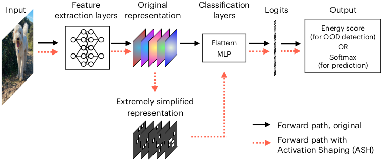

# Extremely Simple Activation Shaping for Out-of-Distribution Detection

Implementation of **A**ctivation **Sh**aping model for OOD detection, NeurIPS 2022.


## Setup

```bash
# create conda env and install dependencies
$ conda env create -f environment.yml
$ conda activate ash
# set environmental variables
$ export DATASETS=<your_path_to_datasets_folder>
$ export MODELS=<your_path_to_checkpoints_folder>
# download datasets and checkpoints
$ bash scripts/download.sh
```
Please download ImageNet dataset manually to `$DATASET` dir by following [this](https://gist.github.com/bonlime/4e0d236cf98cd5b15d977dfa03a63643) instructions.

## Run
```bash
$ python ood_eval.py --config config/imagenet_config.yml --use-gpu --use-tqdm
```

## Usage

```python
import torch
import torch.nn as nn

from ash import ash_b, get_score

class Net(nn.Module):
    ...
    def forward(self, x: torch.Tensor) -> torch.Tensor:
        x = self.features(x)
        x = self.avgpool(x)
        
        # add activation shaping to forward pass of your network
        x = ash_b(x)
        
        x = torch.flatten(x, 1)
        x = self.classifier(x)
        return x

net = Net()
for i, data in enumerate(trainloader, 0):
    inputs, labels = data
    logits = net(inputs)
    
    # get ood predictions
    ood_prediction = get_score(logits)
```

## References

```bibtex
@inproceedings{sun2021react,
  title={ReAct: Out-of-distribution Detection With Rectified Activations},
  author={Sun, Yiyou and Guo, Chuan and Li, Yixuan},
  booktitle={Advances in Neural Information Processing Systems},
  year={2021}
}
```

```bibtex
@inproceedings{bibas2021single,
  title={Single Layer Predictive Normalized Maximum Likelihood for Out-of-Distribution Detection},
  author={Bibas, Koby and Feder, Meir and Hassner, Tal},
  booktitle={Advances in Neural Information Processing Systems},
  year={2021}
}
```

## Citations

If you use our codebase, please cite our work:

```bibtex
TODO
```
